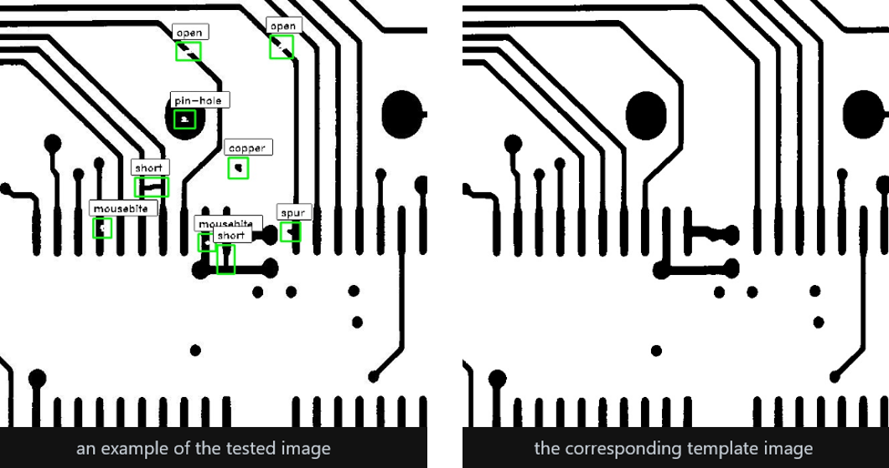
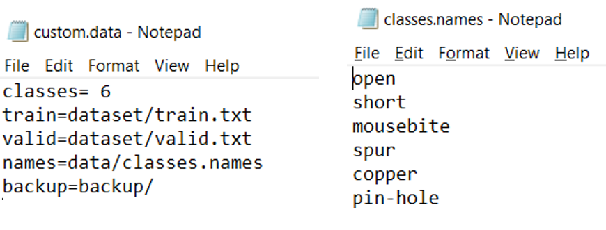
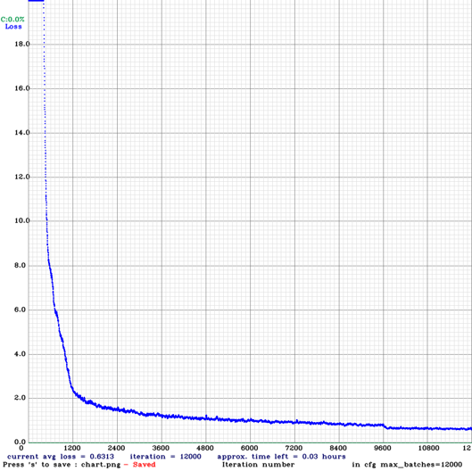
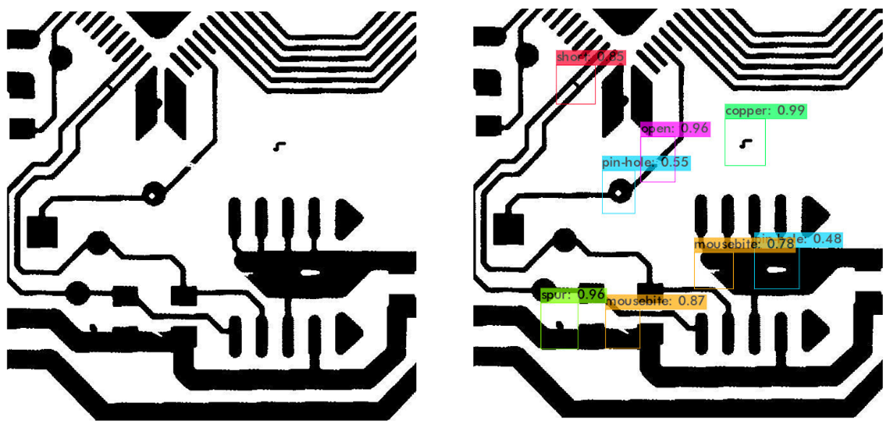
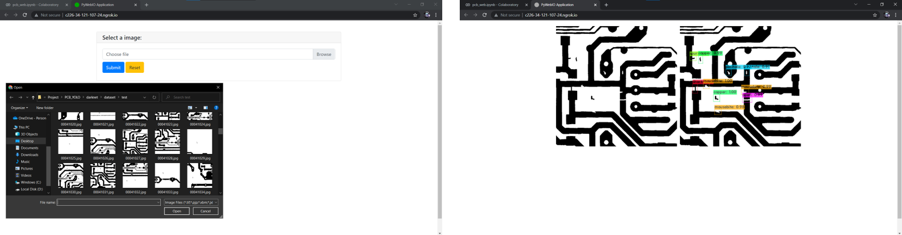

# PCB Defect Detection using YOLO

## Introduction
Printed circuit boards (PCBs) are the primary component of any electronic design. Because of this surge in the demand for PCBs in the market, manufacturers are required to produce PCBs in large quantities. Therefore, maintaining the quality of such large numbers of PCBs is challenging.
The main objective is to develop a PCB defect detection model that reduces the false detection rate and increases the production rate.To tackle this, in this project we are going to identify defects in a PCB using YOLO.
You only look once (YOLO) is a state-of-the-art, real-time object detection system that uses algorithm which applies a single neural network to the full image, and then divides the image into regions and predicts bounding boxes and probabilities for each region.

## Dataset Used

- Name: DeepPCB
- Source: https://www.kaggle.com/yidazhang07/bridge-cracks-image?select=DeepPCB

## Configuring YOLO
We need three configuration files and pretrained convolutional weights (darknet53) to start our training process:

- custom.data: This file contains information of resource, input and output of training process. 
- classes.names: This file contains classes that we plan to train.
- yolov3_custom.cfg: We used the tiny_yolo.cfg and configure it to fit our training requirement.
- darknet53: For training we use convolutional weights that are pre-trained on Imagenet. We use weights from the darknet53 model. 
- yolov3_custom.cfg: We used the yolov3.cfg and configure it to fit our training requirement.
These values were configured in accordance with the documentation given for yolov3 to fit our dataset. [https://github.com/AlexeyAB/darknet#how-to-train-to-detect-your-custom-objects]

## Training Process
The training process was completed for 12000 iterations and its weights were stored in the drive for predictions. The loss function during the process is as follows:

## Results
For a random image from test dataset, the results was as follow:

## User Interface
We have implemented a simple web application for our project using pywebIO (which is a Python library that allows you to build simple web applications without the knowledge of HTML and JavaScript) to demonstrate our project.

